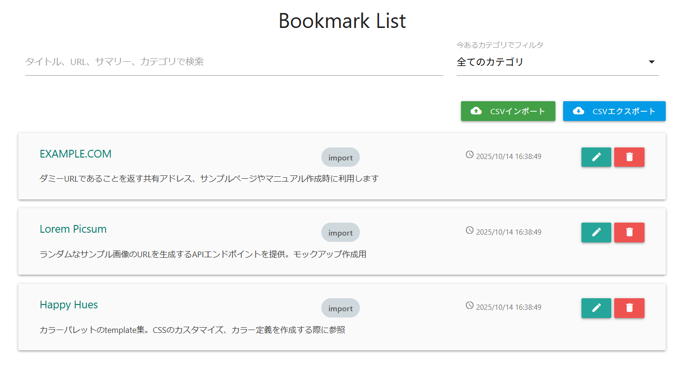

# Bookmark Scribe
Bookmark Scribe は、**頻繁には使わないが時々参照が必要な開発リソース（APIリファレンス、デザインツールなど）** や、**「タイトルだけでは中身がわからない」リンク** を効果的に管理するための Google Chrome 拡張機能です。標準のブラウザブックマークからこれらのリンクを分離し、コンテキストを付加することで、必要な時にすぐに情報を見つけ出せるように設計されています。

## 拡張機能の目的とコンセプト
文脈情報の付加: リンクに利用目的や詳細なサマリーを追記することで、リンクを開かずに内容を把握できます。
- メインブックマークの整理: 参照頻度の低いリンクをローカルに分離し、メインのブラウザブックマークを整理することで、視認性を向上させます。
- データ整合性の保証: URLをユニークなキーとして管理するため、同じリンクを複数登録することを防ぎ、常に最新の情報だけを保持します。

具体的なユースケース:
- **[Happy Hues](https://www.happyhues.co/palettes/17):** このサイトは、WEB制作においてカラーパレットの選択を支援するものですが、頻繁には使用しません。
- **[Lorem Picsum](https://picsum.photos):** このサイトは画像サンプルを作成することをサポートするAPIです。特定のエンドポイントにアクセスすることでサンプル画像のURLを生成します。
- **[Squoosh（webP変換）](https://squoosh.app):** このサイトは、BOLB画像を生成します。

このように頻繁には使わないが、保存しておきたいようなツールやサイトは多くの場合、そのタイトルからだけでは内容を推定することが困難です。このようなツール群をブラウザリンクとは別で管理することで、ブラウザ・リンクともにアクセス性を向上します。
Spreadsheet等で保存するということも考えられますが、Bookmark Scribeはよりスマートなアクセスを提供します。

## 主要機能
- **クイック追加:** 現在開いているページの タイトル と サマリー を入力してクイック保存。タイトルはそのまま編集可能です。URLはユニークキーとして非表示で扱われます。
- **カテゴリ管理:** リンクを任意のカテゴリで分類。（未選択の場合は「未分類」として保存されます。）カテゴリはIDベースで管理されており、設定画面で名称を変更しても、紐付けは維持されます。
- **データ上書き:** 既存のURLと同じリンクを再度保存した場合。常に最新の情報で上書きされます。（重複登録は容認しません。）
- **リストビュー:** リストからページジャンプ、タイトル、サマリー、カテゴリを編集し、情報を更新できます。
- **検索:** リストでタイトル、URL、サマリー、カテゴリ名のすべてを対象にしたインクリメンタル検索が可能です。

### データ連携
- **CSVエクスポート:** 現在のブックマークデータ（タイトル、URL、サマリーのみ）をUTF-8 (BOM付き) の CSV ファイルとして出力します。
- **CSVインポート:** エクスポートした CSV ファイルからデータを復元します。インポートデータは 「Import」カテゴリに固定で分類され、既存データはURLをキーに無条件に上書きされます。

#### CSVインポートファイル作成ルール
データ復元を確実に行うため、インポートファイルの作成時は以下のルールを厳守してください。

**ルール:**
|項目|ルール|補足|
|-|-|-|
|エンコーディング|UTF-8 (BOM付き)|日本語の文字化けを防ぐため、BOM (Byte Order Mark) の付与が必須です。|
|エスケープ|"" (ダブルクォーテーション) による囲み|**全てのフィールド（列）**は、二重引用符 (") で囲む必要があります。内部の " は "" とエスケープしてください。|
|ヘッダー行|必須|読み込みはスキップされます。常に1行目がスキップされるため、必ずヘッダーを付けてください。
|マッピング||列番号でマッピング|

**サンプル:** 行の構造は以下のサンプルを参照してください。この場合、1行目はヘッダー行で実際には読み込みません。
```text
タイトル,URL,コメント
"EXAMPLE.COM","https://example.com","ダミーURLであることを返す共有アドレス、サンプルページやマニュアル作成時に利用します"
"Lorem Picsum","https://example.com","ランダムなサンプル画像のURLを生成するAPIエンドポイントを提供。モックアップ作成用。"
"Happy Hues","https://example.com","カラーパレットのtemplate集。CSSのカスタマイズ、カラー定義を作成する際に参照"
``` 
**カテゴリの取り扱い:** すべてundefinedとして扱います。読み込み後の表示上は `import` として扱われます。

これらのデータを正しくインポートした場合は以下のようになります。


**CSV作成時の注意点:** 
```text
特に、エクセルなどを利用してCSVを作成する場合、多くの問題が発生します。""が消失していないか、BOMファイル形式か等を確認してください。　　
この問題を回避するには、データをエクスポートしたファイルをメモ帳やコードエディタで編集することが有効です。
```
## 技術スタック
- プラットフォーム: Google Chrome 拡張機能 (Manifest V3)
- データストア: chrome.storage.local

共有の定数管理は、 `statics/js/constants.js` に一元化し、コードの保守性と安定性を確保します。